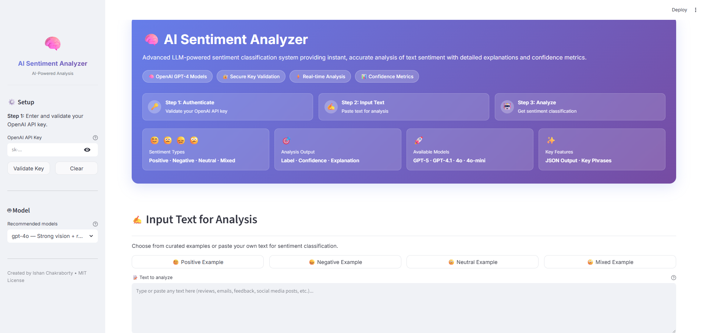

# 🧠 AI Sentiment Analyzer

[](https://streamlit.io/)
[](https://openai.com/)
[](https://www.python.org/)
[](https://opensource.org/licenses/MIT)

> **Advanced LLM-powered sentiment classification system providing instant, accurate analysis of text sentiment with detailed explanations and confidence metrics.**

## 🌐 Live Demo

**[Try it now →](https://sentiment-aianalyzer.streamlit.app/)** - Deployed on Streamlit Cloud

Created by **Ishan Chakraborty** | [MIT License](LICENSE)

---

## 📸 Application Preview



---

## 🎯 What is This Application?

The **AI Sentiment Analyzer** is a professional, production-ready web application built with Streamlit that leverages the power of OpenAI's latest language models (including GPT-5, GPT-4.1, and GPT-4o) to analyze and classify text sentiment with unprecedented accuracy.

Unlike traditional rule-based sentiment analyzers, this application uses advanced Large Language Models (LLMs) to understand context, nuance, sarcasm, and mixed emotions in text, providing not just a simple label but detailed explanations, confidence scores, and key phrases that justify the classification.

### 🎭 Sentiment Types Supported

- **😊 Positive** - Texts expressing happiness, satisfaction, approval, or optimism
- **😞 Negative** - Texts expressing sadness, dissatisfaction, anger, or criticism
- **😐 Neutral** - Texts that are factual, informational, or balanced
- **😕 Mixed** - Texts containing both positive and negative sentiments

---

## ✨ Key Features

### 🔐 Secure API Key Management
- **Real-time validation** of OpenAI API keys
- **In-memory storage** - keys never saved to disk
- **Active key verification** through OpenAI's API
- **Clear feedback** on key status and errors

### 🤖 Multiple AI Models
- **GPT-5** - Next-generation flagship model with reasoning capabilities
- **GPT-5 Mini** - Optimized version for speed and efficiency
- **GPT-4.1** - Latest stable GPT-4 generation
- **GPT-4.1 Mini** - Cost-effective GPT-4 variant
- **GPT-4o** (Default) - Balanced performance and speed
- **GPT-4o Mini** - Fast, lightweight option

### 🧠 Advanced Reasoning Support
- **Thinking steps visualization** for GPT-5 reasoning models
- **Detailed reasoning process** showing how the model arrives at conclusions
- **Expandable reasoning viewer** for transparency

### 📊 Comprehensive Analysis Output
- **Sentiment Label** - Clear classification (Positive/Negative/Neutral/Mixed)
- **Confidence Score** - Percentage showing model certainty
- **Detailed Explanation** - 1-3 sentence justification
- **Key Phrases** - 3-8 extracted phrases supporting the classification
- **JSON Output** - Structured data format for easy integration

### 🎨 Professional User Interface
- **Modern gradient design** with glass-morphism effects
- **Responsive layout** that works on all screen sizes
- **Interactive stat cards** showing application capabilities
- **Color-coded results** with sentiment-specific styling
- **Curated examples** for each sentiment type

### 📝 Smart Examples
- Pre-loaded realistic examples for all four sentiment types
- One-click insertion into the text area
- Real-world scenarios including product reviews, social media posts, and feedback

---

## 🚀 Getting Started

### Prerequisites

- **Python 3.8+** installed on your system
- **OpenAI API Key** - Get one from [OpenAI Platform](https://platform.openai.com/api-keys)
- **Internet connection** for API calls

### Installation

1. **Clone or download this repository**

```bash
git clone https://github.com/Ishan96Dev/AI-Sentiment-Analyzer.git
cd AI-Sentiment-Analyzer
```

2. **Create a virtual environment** (recommended)

```bash
# On Windows
python -m venv .venv
.venv\Scripts\activate

# On macOS/Linux
python3 -m venv .venv
source .venv/bin/activate
```

3. **Install dependencies**

```bash
pip install -r requirements.txt
```

### Running the Application

**Start the Streamlit app:**

```bash
streamlit run app.py
```

**The app will automatically open in your default browser at:**
```
http://localhost:8501
```

---

## 📖 End-to-End User Journey

### Step 1: Setup & Authentication 🔐

1. **Launch the application** using `streamlit run app.py`
2. **Open your browser** to `http://localhost:8501`
3. **Locate the sidebar** on the left with the "⚙️ Setup" section
4. **Enter your OpenAI API Key** in the password field
   - Get your key from [OpenAI Platform](https://platform.openai.com/api-keys)
   - Format: `sk-...` (starts with "sk-")
5. **Click "Validate Key"** button
6. **Wait for validation** - The app will:
   - Check key format
   - Make a test API call to OpenAI
   - Verify the key is active and has proper permissions
7. **See confirmation** - Green success message or red error message

### Step 2: Model Selection 🤖

1. **Choose your AI model** from the dropdown in the sidebar
   - **For best results:** `gpt-4o` (default)
   - **For reasoning transparency:** `gpt-5` or `gpt-5-mini`
   - **For speed:** `gpt-4o-mini` or `gpt-4.1-mini`
   - **For latest features:** `gpt-4.1`
2. **Model automatically selected** - No need to save or confirm

### Step 3: Input Text ✍️

1. **Scroll to "✍️ Input Text for Analysis"** section
2. **Choose an option:**
   - **Option A:** Click one of the example buttons:
     - 😊 Positive Example
     - 😞 Negative Example
     - 😐 Neutral Example
     - 😕 Mixed Example
   - **Option B:** Type or paste your own text
3. **Text appears in the text area** - You can edit it further
4. **Supported text types:**
   - Product reviews
   - Customer feedback
   - Social media posts
   - Email messages
   - Survey responses
   - Any text up to ~2000 words

### Step 4: Run Analysis 🤖

1. **Click the "🤖 Run Analysis" button**
2. **Wait for processing** - You'll see:
   - For reasoning models (GPT-5): "🧠 {model} is thinking and reasoning..."
   - For standard models: "Analyzing sentiment..."
   - Typical processing time: 2-8 seconds
3. **Model processes your text:**
   - Reads and understands context
   - Identifies sentiment indicators
   - Extracts key phrases
   - Calculates confidence score
   - Generates explanation

### Step 5: Review Results 📊

1. **Results appear below the analysis button** in a color-coded card:
   - **Green card** = Positive sentiment
   - **Red card** = Negative sentiment
   - **Gray card** = Neutral sentiment
   - **Orange card** = Mixed sentiment

2. **Review the four components:**

   **a) Sentiment Label & Confidence**
   - Large sentiment indicator (e.g., "😊 Positive")
   - Percentage confidence (e.g., "92% confidence")

   **b) Explanation**
   - 1-3 sentences explaining why the text has this sentiment
   - Clear justification of the classification

   **c) Key Phrases**
   - 3-8 important phrases from your text
   - Shown as colored pills/badges
   - Highlights the words that most influenced the sentiment

   **d) Reasoning Steps** (GPT-5 models only)
   - Click "🧠 View Model Reasoning Process" to expand
   - See step-by-step thinking process
   - Understand how the model arrived at its conclusion

### Step 6: Analyze More Text (Optional) 🔄

1. **Clear or modify the text area**
2. **Enter new text** or click another example
3. **Click "Run Analysis"** again
4. **Compare results** - Previous results stay visible until new analysis completes
5. **Switch models** to see how different models analyze the same text

### Step 7: Error Handling 🛠️

**If something goes wrong, the app will show clear error messages:**

- **"Please enter an API key"** - You haven't entered a key yet
- **"Invalid API key format"** - Key doesn't start with "sk-"
- **"Invalid API key"** - Key is incorrect or expired
- **"Rate limit exceeded"** - Too many requests, wait a moment
- **"Network error"** - Check your internet connection
- **"Model not found"** - Selected model not available on your account

---

## 🏗️ Technical Architecture

### Tech Stack

- **Frontend Framework:** Streamlit 1.36+
- **LLM Provider:** OpenAI API 1.40+
- **Language:** Python 3.8+
- **Styling:** Custom CSS with Google Fonts (Inter)
- **State Management:** Streamlit Session State

### Project Structure

```
sentiment-analysis-app/
├── app.py                    # Main application file (360 lines)
├── requirements.txt          # Python dependencies
├── README.md                # This file
├── LICENSE                  # MIT License
├── .gitignore               # Git ignore rules
├── .streamlit/
│   └── config.toml          # Streamlit configuration
└── assets/
    └── app-screenshot.png   # Application screenshot
```

### Key Components

#### 1. API Key Validation (`validate_api_key`)
- Regex format checking
- Live API validation via `client.models.list()`
- Error handling for authentication issues

#### 2. Sentiment Analysis (`analyze_sentiment`)
- Structured JSON response from LLM
- Reasoning extraction for GPT-5 models
- Confidence score normalization
- Key phrase extraction (up to 12 phrases)

#### 3. Model-Specific Parameter Handling
- **GPT-5/Reasoning models:** `temperature=1` (required)
- **Standard models:** `temperature=0` (deterministic output)
- Automatic detection and configuration

#### 4. User Interface Components
- Hero section with gradient background
- Stat cards with hover effects
- Process flow visualization
- Color-coded result cards
- Expandable reasoning viewer

---

## 📋 Requirements

### Python Packages

```txt
streamlit>=1.36.0
openai>=1.40.0
```

### System Requirements

- **RAM:** 512 MB minimum
- **Storage:** 100 MB for virtual environment and dependencies
- **Network:** Stable internet connection for API calls
- **Browser:** Modern browser (Chrome, Firefox, Safari, Edge)

---

## 🔒 Security & Privacy

### API Key Handling
- ✅ Keys stored only in **session state** (memory)
- ✅ Keys **never written to disk** or log files
- ✅ Keys **cleared when browser tab closes**
- ✅ Keys **not visible** in UI (password field)

### Data Privacy
- ✅ **No data storage** - Text not saved anywhere
- ✅ **Direct API calls** - No intermediary servers
- ✅ **OpenAI's privacy policy** applies to API usage
- ⚠️ **OpenAI processes your text** for analysis

### Best Practices
- 🔐 Never commit API keys to version control
- 🔐 Use environment variables for production deployments
- 🔐 Rotate API keys regularly
- 🔐 Set usage limits in OpenAI dashboard

---

## ⚙️ Configuration

### Streamlit Settings

Edit `.streamlit/config.toml` to customize:

```toml
[server]
headless = true

[theme]
base = "light"
primaryColor = "#667eea"
backgroundColor = "#ffffff"
secondaryBackgroundColor = "#f0f2f6"
textColor = "#1f2937"
```

### Model Selection

Edit `app.py` to change default model:

```python
DEFAULT_MODEL = "gpt-4o"  # Change to preferred model
```

---

## 🎨 Customization

### Adding New Models

Update the `RECOMMENDED_MODELS` list in `app.py`:

```python
RECOMMENDED_MODELS = [
    ("your-model-id", "Your model description"),
    # ... existing models
]
```

### Changing Colors

Modify the CSS in the `main()` function:

```python
# Hero gradient
background: linear-gradient(135deg, #667eea 0%, #764ba2 100%);

# Sentiment colors
Positive: #10b981 (green)
Negative: #ef4444 (red)
Neutral: #6b7280 (gray)
Mixed: #f59e0b (orange)
```

### Adding More Examples

Update the `EXAMPLES` dictionary in `app.py`:

```python
EXAMPLES = {
    "Positive": "Your positive example text...",
    "Negative": "Your negative example text...",
    "Neutral": "Your neutral example text...",
    "Mixed": "Your mixed example text..."
}
```

---

## 🐛 Troubleshooting

### Common Issues

**Issue:** "Module not found" error
```bash
Solution: pip install -r requirements.txt
```

**Issue:** API key validation fails
```bash
Solution: 
1. Check key format (starts with "sk-")
2. Verify key is active at platform.openai.com
3. Check internet connection
4. Ensure you have API credits
```

**Issue:** Model not found error
```bash
Solution:
1. Check if model is available on your OpenAI account
2. Some models require special access
3. Try gpt-4o or gpt-4o-mini instead
```

**Issue:** Streamlit won't start
```bash
Solution:
1. Ensure virtual environment is activated
2. Check Python version (3.8+)
3. Reinstall: pip install --upgrade streamlit
```

---

## 📊 Model Comparison

| Model | Speed | Cost | Reasoning | Best For |
|-------|-------|------|-----------|----------|
| **gpt-5** | ⭐⭐⭐ | 💰💰💰 | ✅ Yes | Complex analysis, transparency |
| **gpt-5-mini** | ⭐⭐⭐⭐ | 💰💰 | ✅ Yes | Fast reasoning |
| **gpt-4.1** | ⭐⭐⭐ | 💰💰💰 | ❌ No | Latest features |
| **gpt-4.1-mini** | ⭐⭐⭐⭐ | 💰💰 | ❌ No | Cost-effective |
| **gpt-4o** | ⭐⭐⭐⭐ | 💰💰 | ❌ No | Balanced (default) |
| **gpt-4o-mini** | ⭐⭐⭐⭐⭐ | 💰 | ❌ No | High-volume, speed |

---

## 📄 License

This project is licensed under the **MIT License** - see the [LICENSE](LICENSE) file for details.

```
MIT License

Copyright (c) 2025 Ishan Chakraborty

Permission is hereby granted, free of charge, to any person obtaining a copy
of this software and associated documentation files (the "Software"), to deal
in the Software without restriction, including without limitation the rights
to use, copy, modify, merge, publish, distribute, sublicense, and/or sell
copies of the Software, and to permit persons to whom the Software is
furnished to do so, subject to the following conditions:

The above copyright notice and this permission notice shall be included in all
copies or substantial portions of the Software.
```

---

## 👨‍💻 Author

**Ishan Chakraborty**

- 📧 Email: [your-email@example.com]
- 💼 LinkedIn: [your-linkedin-profile]
- 🐱 GitHub: [your-github-profile]

---

## 🤝 Contributing

Contributions, issues, and feature requests are welcome!

1. Fork the repository
2. Create your feature branch (`git checkout -b feature/AmazingFeature`)
3. Commit your changes (`git commit -m 'Add some AmazingFeature'`)
4. Push to the branch (`git push origin feature/AmazingFeature`)
5. Open a Pull Request

---

## 🌟 Acknowledgments

- **OpenAI** for providing powerful language models
- **Streamlit** for the excellent web framework
- **The open-source community** for inspiration and support

---

## 📞 Support

If you encounter any issues or have questions:

1. Check the [Troubleshooting](#-troubleshooting) section
2. Review [OpenAI's documentation](https://platform.openai.com/docs)
3. Check [Streamlit's documentation](https://docs.streamlit.io)
4. Open an issue in this repository

---

**⭐ If you find this project helpful, please consider giving it a star!**
